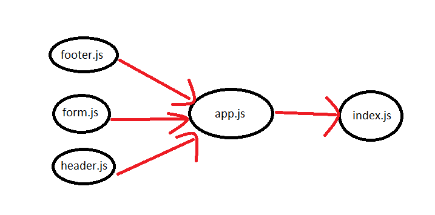

# resty

### Author: Esra'a Mamoun

### Links and Resources

- [submission PR - class-26](https://github.com/EsraaMamoun-401-advanced-javascript/resty/pull/1)

### Setup

### Modules
- footer.js
- form.js
- header.js
- app.js
- index.js

### Packages
- node-sass
- react
- react-dom
- react-scripts

#### How to initialize/run your application (where applicable)

- `npm run start`

<!-- #### Tests

* How do you run tests?
 > - Jest test: `npm test` 
 > - console.log -->

#### UML
